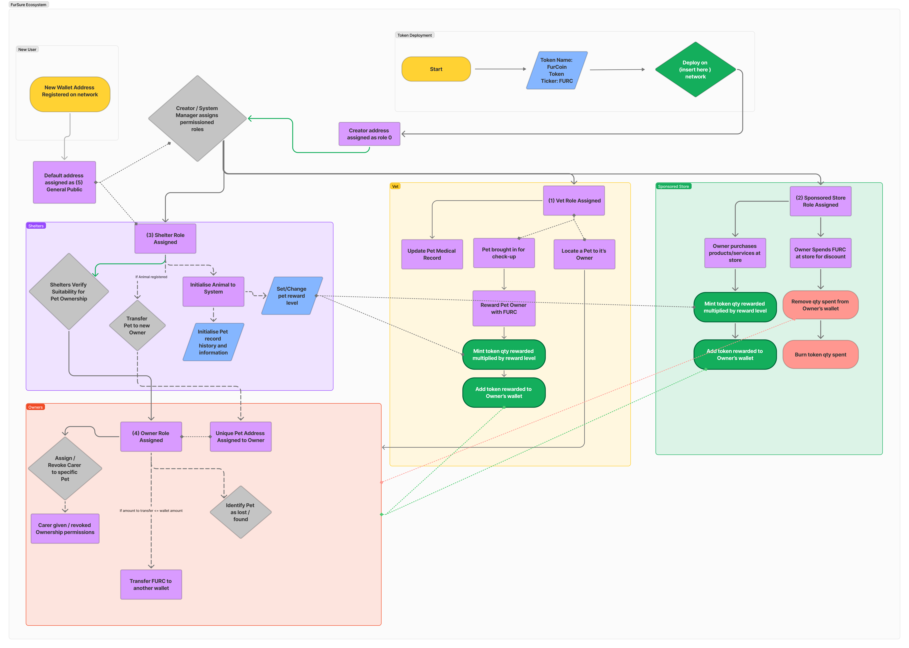
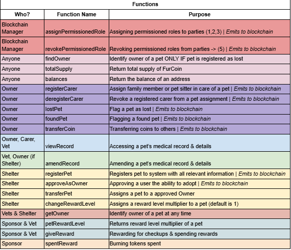
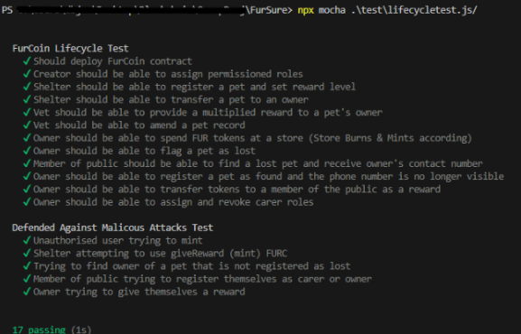

## Protocol Design

## Background & Motivation
We have created the concept and framework for a blockchain system named FurSure, which will be a decentralised permissioned blockchain system and digital ledger. Specifics of functions and permissions will be detailed under the Protocol Design section. For now, we will give a high-level view of FurSure.

FurSure serves as a platform for multiple parties: Adopters, Animals Shelters, Vets and Pet Stores. It operates through a token called FurCoin, defined by our custom ERC-20 smart contract, which is essential to the system’s economy.

Pet owners will engage with the system and earn rewards from veterinary practices for attending regular health checkups. This incentivises owners to prioritise the well-being of their pets, ensuring proper care. Additionally, the system includes the option for granting trusted temporary carers, such as petsitters, or family members who may be looking after the animal for a period of time.

These rewards in the form of a FurCoin token, can be redeemed for discounts at participating pet care stores that sponsor the system.

Animal shelters will utilise the system to register animals, creating a unique address identifier and blank medical record for each pet. Once a potential adopter passes the shelter’s regulatory checks, the shelter can transfer ownership of the animal. Once a potential adopter passes the shelter’s pre-existing regulatory background checks, the shelter can then transfer ownership of an animal to the new owner. The unique address of a pet will be stored in it’s microchip, which is already common practice in the UK and many other countries.

To address the issue of elderly or sick animals often being overlooked in shelters, we allow the shelters to set a higher reward level for such animals. This incentivises adopters to consider giving these end-of-life animals a for their final years, with the system subsidising the cost of care.

Sponsored stores contribute capital to maintain the system, and in return, FurCoin can be used at their stores to apply discounts. FurCoins may also be rewarded through spending at these stores. As our system grows, so does the market share of our sponsored stores, creating a mutually beneficial relationship.
An important feature of FurSure is the Lost & Found system. This allows pet owners to register a pet as lost on the system. If the pet is found by a member of the public, it will return the details of the registered owner, but only if the pet has been registered as lost, protecting the owner from malicious use of this function. Alternatively, if the pet is taken to a vet or shelter, these truster parties can locate the owner at any time.
Currently, there are no existing successful implementations of our idea, which will be outlined in detail throughout the document. Although, there have been several attempts:
There are currently no successful implementations of our idea, though there have been several attempts. For example, Pawtocol [1] , a Canadian company, had a website with broken links and little recent activity. Their blockchain had four main functions, including a pet NFT marketplace and a blockchain pet tag, but the project appears to have failed. 
We also found a GitHub repo called "Adopt-Pet" [2] created by an IIT student, which claimed to provide a safe way for pet adoption. However, the smart contract code was basic and insufficient, suggesting another failed attempt. These examples reassure us that there are no fully developed systems in this space, leaving room for FurSure to succeed where others have faltered.
Additionally, there has been a research paper titled “Adoption of Pets in Distributed Network using Blockchain Technology” by Gururaj H. L. [3], which provides a theoretical basis for a pet adoption marketplace in the form of a website. However, it is simply just a secure one-time transactional concept, with no extensions or functionalities beyond that.

## Security Testing

